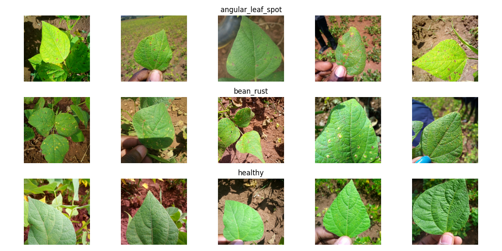

# Beans Disease Classification
This repository contains a Convolutional Neural Network (CNN) model and a transfer learning model for classifying beans plant diseases from images.

# Overview
This project leverages deep learning techniques to classify beans diseases from images. It includes both a custom CNN model and a transfer learning model
based on ResNet50. The models are trained and evaluated on a dataset of beans disease images, aiming to provide accurate disease classification.

# Dataset
The dataset used for training and evaluating the models is the <a href='https://github.com/AI-Lab-Makerere/ibean/tree/master'>ibean (AI Lab Makerere)</a> dataset. It consists
of a total of 1296 images spread across three classes (angular_leaf_spot, bean_rust, and healthy). The dataset was divided into training, validation, and testing.

# Model Comparison
The accuracies of the models on the test set:

| Model         | Accuracy |
|---------------|----------|
| beanCNN       | 0.92     |
| ResNet50      | 0.94     |

From the table above, ResNet50 produced a higher accuracy than the custom CNN. This is because ResNet50 utilizes pretrained weights and a deeper architecture, 
which allows it to capture more complex features and patterns in the data, leading to better performance in classification tasks.

